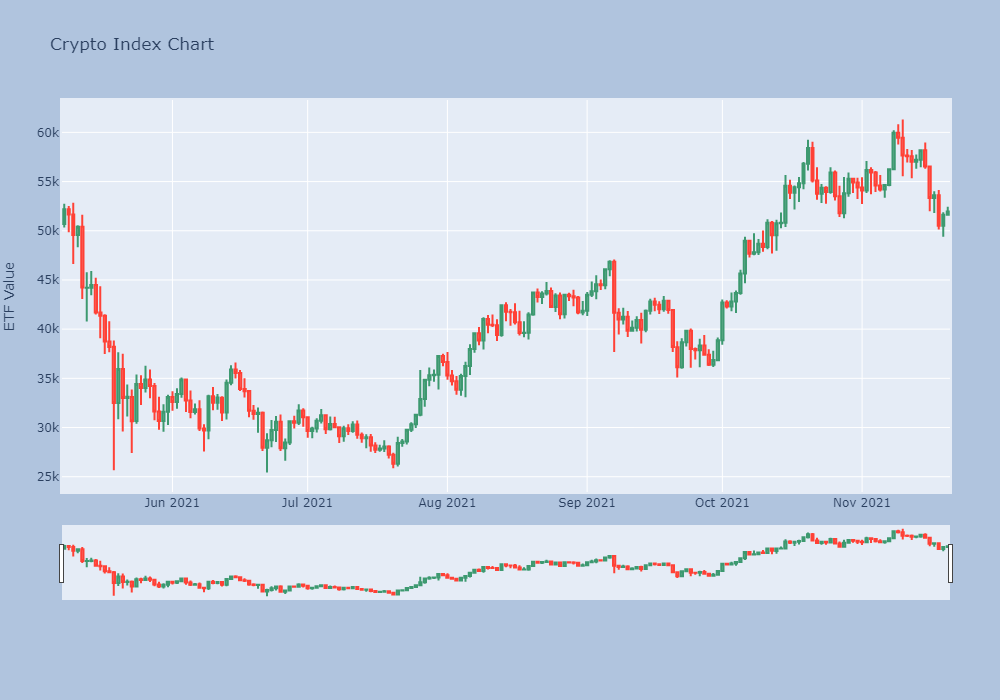
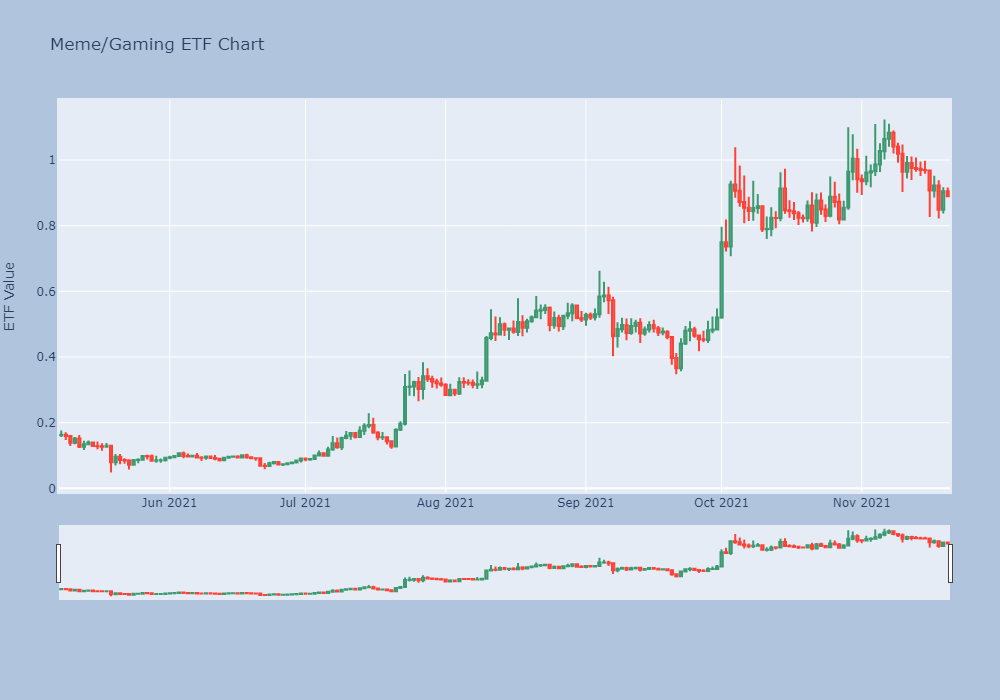
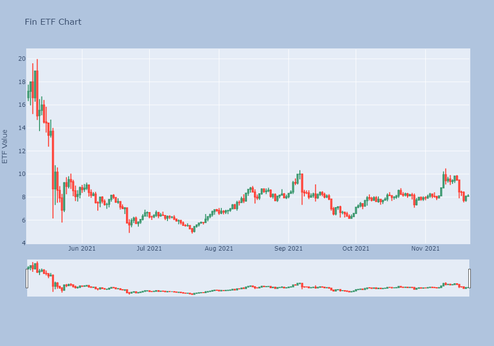
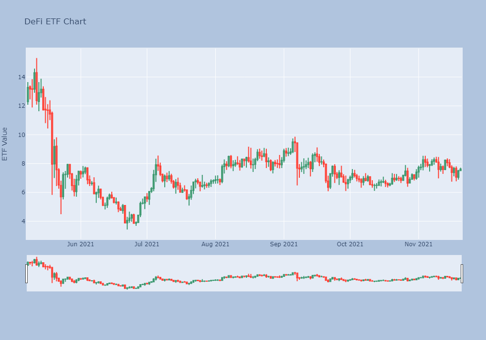
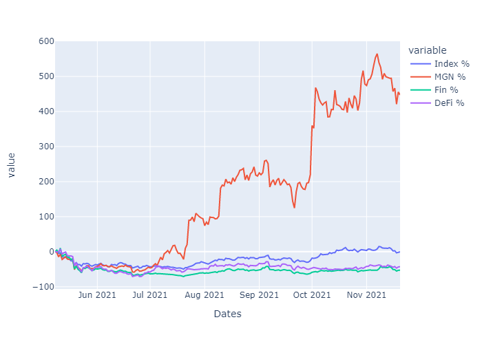
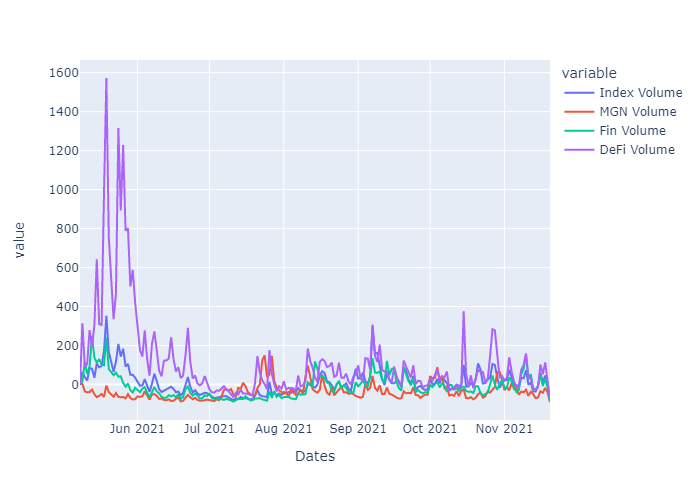
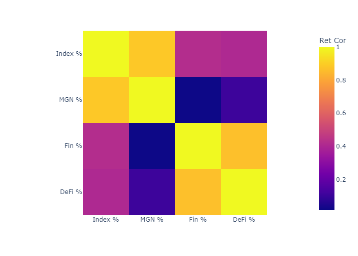
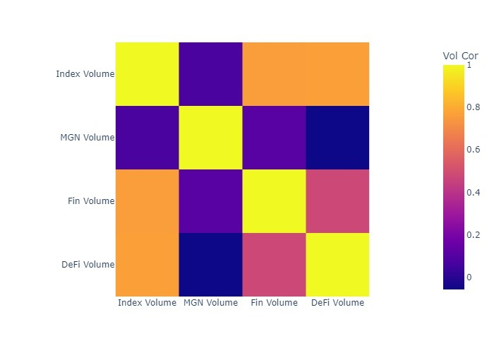

# Crypto Index and ETFs

TJ McDowell, Chris Kwiatkowski, Troy Albany, Edward Schryver

---
## Scope and Origin

The scope of this project was to create a base cryptocurrency index and ETFs consisting of cryptocurrencies broken up by different categories that the cryptocurrency falls in, making it simpler for the average person to invest in cryptocurrencies. There are over 5000 stock market indexes and 7500 stock market ETFs available to investors. These allow the average investor, who doesn't have the time and/or knowledge to invest in individual companies, to invest in the stock market and choose what to invest in based on sectors, assets, etc. In our research, we discovered there are no popular indexes or ETFs available to investors who want to put their money in cryptocurrency. There are over 6000 cryptocurrencies and there are more being created every day.  Choosing individual cryptocurrencies to invest in can be extremely difficult. There is a lot that goes into an analysis when making the decision of what coins to invest in, and most people don't have the capacity to conduct this analysis.  Separating these cryptocurrencies into different categories allows an investor that doesn't have knowledge of individual coins to make an easier decision based on the category as a whole. 

---

## Base Index and ETFs

For this project, we created a base index and three different ETFs. The base index is representated by the top 19 cryptocurrencies by total market cap. The three ETFs we created are separated into three different categories of cryptocurrencies: Meme and Gaming, Financial, and DeFi. The value of base index and three ETF's are reprented by taking the market cap of each cryptocurrency as a percentage of the total cryptocurrency market cap and multiplying them by the price of each coin and then adding them together. 

---

## Data Gathering and Hypothesis

The market cap % which were eventually used to calculate the value of the index or ETF were obtained from CoinMarketCap.com. As mentioned, the base index is made up of the top 19 crytpocurrencies by market cap, which make up over 83% of the total crypto market cap. We hand picked the individual cryptocurrenices to make up each of the three individual ETFs. They are broken up as follows (By Ticker):

Meme and Gaming: DOGE, MANA, SAND, ENJ, AXS, DGB, CHZ, THETA, XTZ

Financial: XRP, XLM, XDC, XTZ, LTC, BCH, HBAR

DeFi: AVAX, LINK, UNI, COMP, LUNA, ALGO, MATIC

Using the exchanges KuCoin and Binance, we used the past six months of prices of each of these coins to track the movement of the index over those six months and turned the data into a percent return, which was the data that we plotted for our analysis.

Our basic hypothesis was that the ETFs would follow the index over the six month period analyzed. 

---

## Base Index

As this chart shows, the base index began with a value of around $50,000 at the beginning of the period of analysis, dropped by over 50%, and then beginning at the end of July rose fairly steadily over the next four months, passing above the original starting point, before finally falling back to just about the same point as the start, an increase of 100%, which is where we currently stand.

---

## Meme and Gaming ETF

The gaming/meme token sector performed extremely well during the six month period of analysis. As the chart displays, after the initial drop of 50% in May, the value of the ETF rose from around $0.10 at to over $1.00 at the high point at the beginning of November, an increase of over 900% before dropping slightly to slightly above $0.80. When looking at possible reasons for this growth, we can factor in the rise in popularity of NFT's and the media coverage that the gaming industry has received in the past two months, particulary the announcement by Facebook of their name change to "Meta."

---

## Financial ETF

As the chart depicts, the financial tokens we chose did not perform well during the six month period of analysis. The value of this ETF, starting around $18 fell to around $5, a decrease of about 72% at the low point at the beginning of July. While the value followed the trend of the overall crypto market beginning at the end of July, it did not perform as well, increasing only 60% from the low to current value of around $8. Overall, after the prices of these coins included in this ETF surged during the first leg of the bull run at the beginning of 2021 (not included in this analysis), they followed the rest of the market in the drop at the middle/end of May, and since have not recovered like investors in these coins would like to see. 

---

## DeFi ETF

The value of the DeFi ETF began around $13 at the start of our analysis and declined to below $4 at the low point in July, a decrease of over 69%.  Again, we can see in the chart the trend followed the rest of the crypto market from July until present, rising 100%, the same rate as our base index. Similar to the cryptos represented in the Financial ETF, there was no news or catalyst that caused these coins to outperform the crypto market as a whole.

---

## Conclusion - Index and ETF Comparison

The top chart displays an overlay of the returns of the base index and three ETFs and the bottom chart displays an overlay of the daily trading volume of the base index and three ETFs.  As one can clearly see, the Meme and Gaming ETF greatly outperformed the not only the Financial and Defi ETFs, but the base index as well. While the base index basically finished the period of analysis at neither a loss or gain, the value of the Meme and Gaming ETF increased by about 450%. The value of the DeFi ETF decreased by about 40%, and the value of the Financial ETF decreased by almost 50%. The display of the trading volume of the coins in these ETFs is also interesting as we can see by the chart that there was very high volume of the DeFi ETF during the drop in May and the down month in June, depicting a lot of selling. Additionally, while the Meme and Gaming ETF vastly outperformed the other funds in the analysis, it had the lowest trading volume throughout the analysis. 

The first matrix shows the correlation between the returns of indexes and the ETFs. This shows a strong correlation between the index and the Meme/Gaming ETF while it shows very little correlation between the index and Financial and DeFi ETFs as well as little correlation between the ETFs themselves. The second matrix shows the correlation between the volume of the indexes and ETFs. We can see there exists a strong correlation between the volume of the index and the Financial and DeFi ETFs. In the end, our hypothesis that each ETF would follow the general trend of the market during this six month period was invalidated, as the Meme and Gaming ETF performed much better, while the Financial and DeFi ETFs performed much worse.

